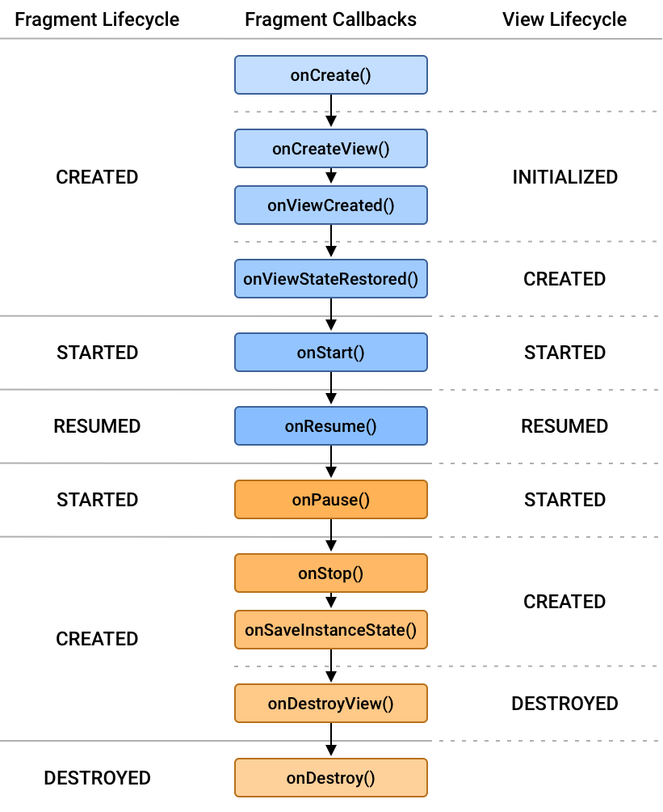

# 8장. UI 프래그먼트와 프래그먼트 매니저

- 액티비티는 UI 유연성을 제공하도록 설계되지 않았다. 액티비티의 뷰들은 런타임 시에 변경되며, 이 뷰들을 제어하는 코드는 액티비티의 내부에 있어야 한다. 따라서 액티비티는 사용하는 특정 화면과 강하게 결합되어
  있다.

## 프래그먼트 개요

- UI를 관리하는 프래그먼트를 UI 프래그먼트라고 한다. UI 프래그먼트는 레이아웃 파일로부터 inflate되는 자신의 뷰를 하나 갖는다. 프래그먼트의 뷰는 사용자가 보면서 상호 작용하기를 원하는 UI 요소들을
  포함한다.
- 액티비티 뷰는 자신의 UI를 갖는 대신 프래그먼트를 넣을 컨테이너를 가지게 되며, 이 컨테이너에는 inflate된 프래그먼트의 뷰가 추가된다. 액티비티는 여러 개의 다른 프래그먼트 뷰를 수용하는 다수의 컨테이너를
  가질 수 있다.

## CriminalIntent 앱 개발 시작하기

- CrimeFragment의 인스턴스는 MainActivity라는 액티비티가 호스팅한다. 호스팅이란, 자신의 뷰 계층 구조에 fragment와 그 뷰를 포함하는 곳을 제공하는 것이다.
- 프래그먼트는 **화면의 보이는 뷰를 자체적으로 가질 수 없으며**, 액티비티의 뷰 계층에 추가될 때만 화면에 자신의 뷰가 보인다.

## 프래그먼트 생명주기 함수 구현하기

- Fragment는 모델 및 뷰 객체와 상호 작용하는 컨트롤러다. 따라서 특정 범죄의 상세 내역을 보여주고 사용자가 수정한 상세 내역 데이터를 변경하는 것이 CrimeFragment의 역할이다.
- Fragment의 생명주기 함수(onCreate 등)는 public 함수이다. 이 프래그먼트를 호스팅하는 어떤 액티비티에서도 자동 호출되어야 하기 때문이다.
- Fragment는 Activity와 유사하게 자신의 상태 데이터를 저장하거나 가져오는 Bundle 객체를 갖는다. 그리고 필요에 따라 Fragment.onSaveInsatenceState(Bundle) 함수를
  오버라이드 할 수 있다.
- Fragment 인스턴스는 onCreate에서 구성하지만, **프래그먼트의 뷰는 onCreateView(LayoutInflater, ViewGroup?)에서 생성하고 구현한다.**
- 이 함수에서는 프래그먼트 뷰의 레이아웃을 인플레이트한 후 인플레이트 된 View를 호스팅 액티비티에 반환해야 한다. LayoutInflater와 ViewGroup 매개변수는 레이아웃을 인플레이트하기 위해
  필요하다. Bundle은 저장된 상태 데이터를 가지며, onCreateView 함수에서 뷰를 재생성하는 데 사용된다.

    ```kotlin
    override fun onCreateView(
        inflater: LayoutInflater,
        container: ViewGroup?,
        savedInstanceState: Bundle?
    ) : View? {
        val view = inflater.inflate(R.layout.XXX, container, false)
        return view
    }
    ```

- onCreateView 내부에서는 레이아웃 리소스 id를 인자로 전달해 LayoutInflater.inflate(…)을 호출함으로써 프래그먼트의 뷰를 명시적으로 인플레이트한다. inflate(…)의 두번째 인자는
  위젯들을 올바르게 구성하는 데 필요한 뷰의 부모다. 세 번째 인자는 인플레이트 된 뷰를 이 뷰의 부모에게 즉시 추가할 것인지를 LayoutInflater에게 알려준다.
- 여기서는 프래그먼트의 뷰는 액티비티 컨테이너 뷰에 호스팅 되기 때문에 false를 전달하였다. 인플레이트되는 즉시 부모 뷰에 추가할 필요는 없으며, 액티비티가 나중에 이 뷰를 추가한다.
    - true인 경우: 뷰를`container`에 붙이기까지 함. 일반적으로`Adapter`에서 사용? → 실전에서는 **`attachToRoot = false`가 기본**이지만, **정말로 즉시 부모에 붙여야
      하는 경우**나 커스텀 뷰 그룹에서 사용될 수 있다고 함. (by GPT) 아직 못본 것 같긴하다..

## FragmentManager

- FragmentManager는 프래그먼트 리스트와 프래그먼트 트랜잭션의 백 스택을 처리한다. 또한, 프래그먼트의 뷰를 액티비티 뷰 계층에 추가하고 프래그먼트의 생명주기를 주도하는 책임을 갖는다.
- 프래그먼트 트랜잭션은 프래그먼트 리스트에 프래그먼트를 add, remove, attach, detach, replace 하는 데 사용된다. 프래그먼트 트랜잭션을 사용하면 여러 개의 오퍼레이션(트랜잭션으로 실행되는
  각 함수 코드)을 묶어서 수행할 수 있다. 프래그먼트로 런타임 시에 화면을 구성 또는 변경하는 방법의 핵심이 바로 프래그먼트 트랜잭션이다.
- FragmentManager는 프래그먼트 트랜잭션의 백 스택을 유지 관리한다. 따라서, 프래그먼트 트랜잭션이 다수의 오퍼레이션을 포함한다면 해당 트랜잭션이 백 스택에서 제거될 때 이 오퍼레이션이 역으로 실행된다.
  그러므로 다수의 프래그먼트 오퍼레이션을 하나의 트랜잭션으로 묶으면 UI 상태를 잘 제어할 수 있다.
- FragmentManager는 프레임 레이아웃의 리소스 id를 사용해 fragment를 식별한다. 하나의 액티비티에 여러 개의 프래그먼트를 추가한다면, 각 프래그먼트에 대해 별도의 리소스 id를 갖는 컨테이너
  뷰를 생성한다.

    ```kotlin
    override fun onCreate(savedInstanceState: Bundle?) {
        super.onCreate(savedInstanceState)
        Log.d("First", "onCreate $this")
    }
    ```

    - 실제로 Fragment에서 this를 출력하면 아래와 같이 출력된다.
    - `First onCreate FirstFragment{219a217} (a7066e1b-831b-4f0c-8fc2-274095c18faa id=0x7f0800bb)`
    - 219a217: **인스턴스의 메모리 주소 기반 해시값**을`toString()`으로 찍은 것
    - a7066e…: FragmentManager가 프래그먼트를 관리하면서 붙이는 정보
        - a7066…:  프래그먼트의**unique who ID (FragmentManager가 관리용으로 부여)**
        - id=0x7f0800bb: 이 프래그먼트를 붙인**View의 ID (예: R.id.fc_main)**
    - 화면 회전 등으로 인스턴스가 새로 생성될 때, 프래그먼트가 붙어있는 view Id는 동일하므로 a7066.. 부분은 같고, {219a217} 부분만 바뀐 새로운 프래그먼트가 생성된다.

## 프래그먼트 생명주기



- 프래그먼트의 생명주기 함수는 안드로이드 운영체제가 아닌 호스팅 액티비티의 FragmentManager가 호출한다. 프래그먼트는 액티비티가 내부적으로 처리해서 안드로이드 OS는 액티비티가 사용하는 프래그먼트에
  관해서는 아무것도 모른다.
- onCreate, onAttach, onCreateView, onViewCreated 함수들은 프래그먼트를 FragmentManager에 추가할 때 호출된다.
- 🚫 onAcitivityCreated 지원 중단
    - 2020년 3월 18일 업데이트 이후 Fragment의 onActivityCreated가 deprecated 되면서 Activity의 생명주기와 Fragment의 생명주기가 서로 영향을 덜 주는 방향으로
      개편되었다. 원래 onActivityCreated()의 존재 이유 자체가 Activity의 생성이 끝나야만 처리되어야 하는 로직이 Fragment에 있을 때를 위한 것이다. 실제 프로젝트를 수행하다 보면
      빈번히 발생하는 일이기도 하다.
    - onActivityCreated 가 사라지면서 공식문서에서는 View 관련 초기화는 onViewCreated, 나머지 초기화 루틴은 onCreate에서 수행하라고 나와있다.