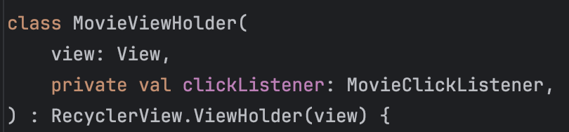
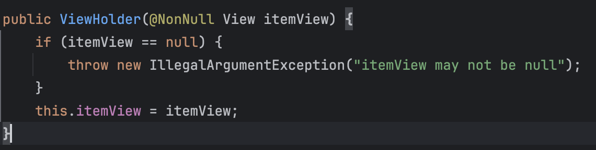

### RecyclerView 추가하기

- RecyclerView가 생성된 후에 바로 LayoutManager를 설정해야 한다. RecyclerView는 항목들을 화면에 위치시키는 일을 직접하지 않고 LayoutManager에 위임한다. 그러면
  LayoutManager가 모든 항목들의 화면 위치를 처리하고 스크롤 동작도 정의한다. 따라서 LayoutManager가 설정되지 않으면 RecyclerView의 작동이 바로 중단된다.

### 항목 뷰 레이아웃

- RecyclerView는 ViewGroup의 서브 클래스이며, item view라고 하는 자식 view 객체들의 리스트를 보여준다.

### viewHolder 구현하기

- RecyclerView는 항목 View가 ViewHolder 인스턴스에 포함되어 있다고 간주한다. ViewHolder는 항목 View의 참조(때로는 항목 뷰에 포함된 특정 위젯의 참조)를 갖는다.
- XXXViewHolder(미션에서는 MovieViewHolder)의 생성자는 항목 View를 인자로 받으며, MovieViewHolder 인스턴스가 생성도리 때 이 뷰는 슈퍼클래스인
  RecyclerView.ViewHolder의 생성자 인자로 전달된다.
  
- RecyclerView.ViewHolder 슈퍼 클래스로부터 상속받은 itemView 속성이 생성자로 전달된 항목 View의 참조를 갖는다.
  
- RecyclerView는 자체적으로 View를 생성하지 않으며, 항상 항목 View를 참조하는 ViewHolder를 생성한다.
- 그런데, MovieViewHolder의 인스턴스는 누가 또는 어디서 생성하는 것일까?

### Adapter

- RecyclerView는 자신이 ViewHolder를 생성하지 않는다. 대신 이 일을 Adapter에게 요청한다. 어댑터는 컨트롤러 객체로, RecyclerView와 RecyclerView가 보여줄 데이터 사이에
  위치한다.
- 어댑터는 다음의 일을 처리한다.
    - 필요한 ViewHolder 인스턴스들을 생성한다.
    - 모델 계층의 데이터를 ViewHolder들과 바인딩한다.
- 그리고 RecyclerView는 다음의 일을 처리한다.
    - 새로운 ViewHolder 인스턴스의 생성을 어댑터에게 요청한다.
    - 지정된 위치의 데이터 항목에 ViewHolder를 바인딩하도록 어댑터에게 요청한다.

- onCreateViewHolder(...): 보여줄 뷰(item_movie)를 인플레이트한 후 이 뷰를 처리하는 ViewHolder 인스턴스를 생성하고 반환한다.
- onBindViewHolder(...): 인자로 전달된 위치에 있는 Movie 객체의 title 등을 MovieViewHolder 인스턴스가 참조하는 TextView의 text 속성에 지정한다.
- 데이터가 저장된 데이터 셋에 몇 개의 데이터가 있는지 Rv가 알아야 할 때 Adapter.getItemCount()를 호출해 어댑터에게 요청한다.
- 화면에 보여줄 Movie 객체 또는 이 객체가 저장된 List를 Rv는 모르며, MovieAdapter가 안다.

## 중간 정리

- RecyclerView는 Adapter의 onCreateViewHolder를 함수를 호출해 MovieViewHolder 인스턴스를 생성한다. 그런 다음 Adapter의 onBindViewHolder(
  viewHolder, Int)함수를 호출한다. 이 때 MovieViewHolder와 데이터 셋 내부의 Movie 객체 위치를 인자로 전달한다. adpater는 이 함수에서 해당 위치의 모델 데이터인 Movie
  객체를 찾아 이것을 MovieViewHolder의 항목 View와 binding한다(Movie 객체의 데이터를 항목 View에 채운다).

### 뷰의 재활용

- 미션에서 영화는 총 10000개까지 생성될 수 있다. RecyclerView가 한꺼번에 10000개의 항목 view를 미리 생성하는 것일까?
- 아니다. 한 화면을 채우는 데 충분한 개수만 생성해, 화면이 스크롤되면서 항목 View가 화면을 벗어날 때 Rv는 해당 항목 View를 버리지 않고 재활용한다.
- 그런 이유로 onCreateViewHolder는 onBindViewHolder보다 덜 호출된다 (수업시간에 제임스가 보여줌). 일단 충분한 수의 viewHolder가 생성되면 RecyclerView는
  onCreateViewHolder의 호출을 중단하고 기존의 ViewHolder를 재활용 해 onBindViewHolder에 전달함으로써 시간과 메모리를 절약한다.

### 리스트 항목의 바인딩 개선하기

- Adapter는 MovieViewHolder가 내부적으로 하는 일을 모르는 것이 좋기 때문에 onBindViewHolder에 bind()함수를 만들고 바인딩 작업은 MovieViewHolder 내부에 두자.

### 리스트 항목 선택에 응답하기

- 각 항목 View는 자신과 연관된 MovieViewHolder를 갖고 있으므로 ViewHolder에서 항목 View의 onClickListener를 구현하면 된다.
- ` reservationButton.setOnClickListener { clickListener.onReservationClick(movie) } `
